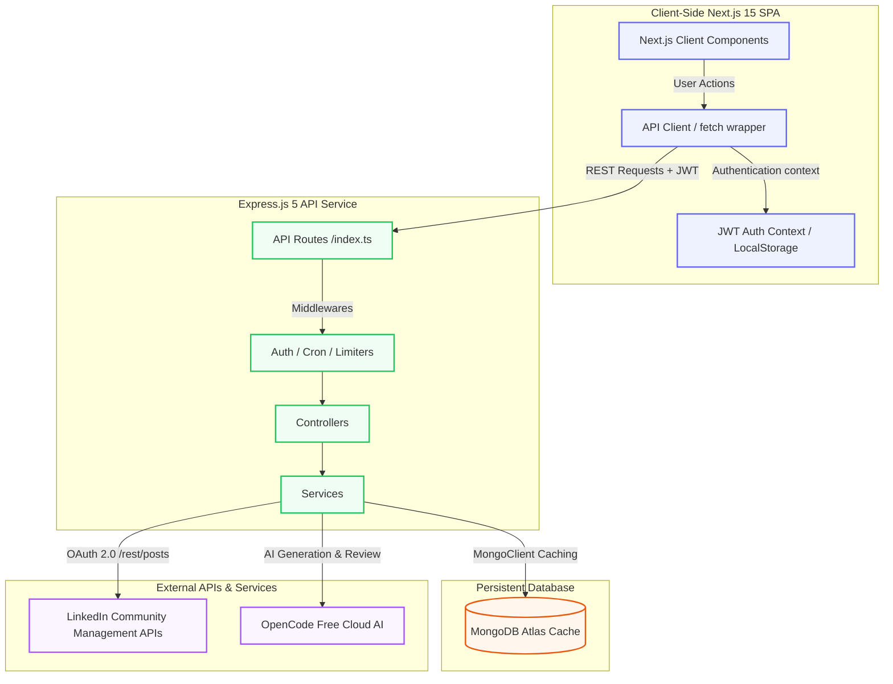
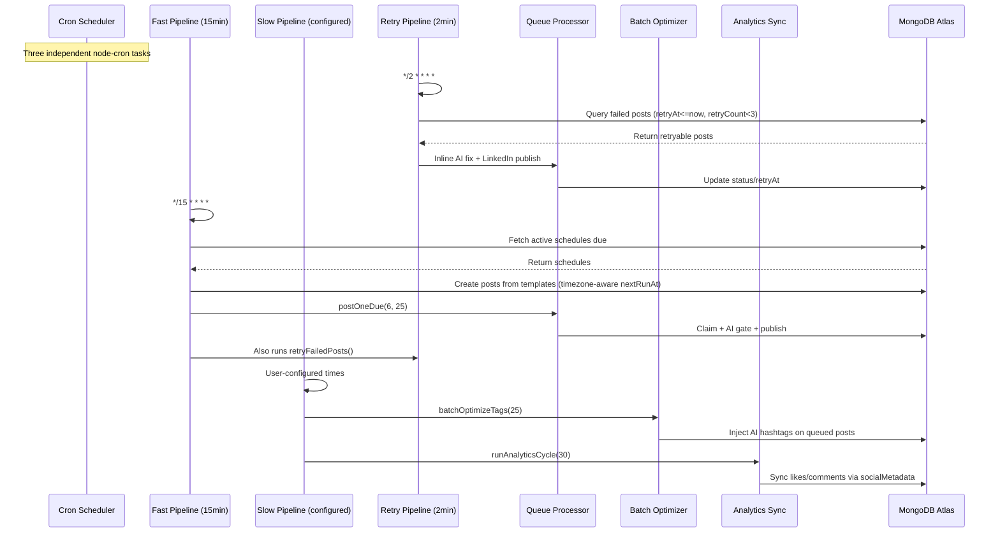

# InkPost — Decoupled System Architecture & Technical Specifications

Welcome to the **InkPost** Developer Guide. This document provides a highly detailed breakdown of the decoupled system architecture, engineering decisions, file structures, API contracts, integration configurations, and standard workflows for the platform.

---

## 🗺️ System Architecture Overview

InkPost is engineered with a **fully decoupled, event-aware distributed architecture** consisting of a modern frontend single-page application (SPA) and an Express.js-powered API gateway.



---

## 🎨 1. Frontend Architecture (Next.js 15 SPA)

The frontend is a **pure client-side Single-Page Application (SPA)** written using Next.js 15 and React 19. All administrative pages utilize `"use client"` and are fully decoupled from any server-side compilation, rendering, or Node.js backend processes.

### 📁 Directory Layout
- [`app/`](file:///home/arvind/Desktop/inkpost/app) — Centralized routing pages. Includes dashboard, analytics, calendars, and schedules.
- [`components/`](file:///home/arvind/Desktop/inkpost/components) — Reusable premium React UI components (visual elements, charts, dialogs).
- [`lib/`](file:///home/arvind/Desktop/inkpost/lib) — Core client-side modules, models, validation helpers, and HTTP clients.

### 🛡️ Client Authentication & Router Guards
Authentication is JWT-based, managed using standard React context API via [`lib/auth-context.tsx`](file:///home/arvind/Desktop/inkpost/lib/auth-context.tsx). 
- **Token Storage**: JWT access tokens are kept purely in-memory. JWT refresh tokens are persisted in `localStorage` for session restoration.
- **Routing Protections**: The client routes are guarded using a wrapper called [`ProtectedRoute.tsx`](file:///home/arvind/Desktop/inkpost/components/ProtectedRoute.tsx). If the context detects that the user session is loading, it presents a premium custom loading spinner. If unauthenticated, it redirects the router securely to `/login`.

### 🔄 Centralized HTTP Agent (`api-client.ts`)
API requests are unified through a custom native `fetch` client located at [`lib/api-client.ts`](file:///home/arvind/Desktop/inkpost/lib/api-client.ts). Key characteristics include:
1.  **Automatic JWT Injection**: Automatically appends the `Authorization: Bearer <accessToken>` header to all request scopes requiring authentication.
2.  **Automatic Token Refresh Loop**: If a request fails with a `401 Unauthorized` status, the agent halts, triggers a refresh request targeting `/auth/refresh` to obtain new tokens, stores them, and silently retries the original request.
3.  **Graceful Expired Session Eviction**: If token refresh fails, the client clears the local storage cache and invokes the `onAuthFail` callback to direct the UI back to `/login`.

### 📝 Client-Side Data Validation
Form models and payload schemas are strictly enforced using **Zod** validator chains located in [`lib/validation.ts`](file:///home/arvind/Desktop/inkpost/lib/validation.ts). This ensures:
- A maximum characters check of `3000` (LinkedIn's API restriction) on all content.
- Pre-submission safety for dates, recurring templates, timezone fields, and credentials.

### 🌍 Timezone Detection
The frontend detects the user's browser timezone via `Intl.DateTimeFormat().resolvedOptions().timeZone` and sends it with all scheduling API calls via `detectTimezone()` in `lib/schedule-utils.ts`. This ensures schedules are created in the user's local time.

---

## ⚙️ 2. Backend Architecture (Express.js 5 API Gateway)

The backend is built as a modular Express.js REST API providing complete service decoupling, lightweight handlers, robust background routines, and database persistence.

### 📁 Directory Layout
- [`backend/src/config/`](file:///home/arvind/Desktop/inkpost/backend/src/config) — Singleton environment variables loader and database configurations.
- [`backend/src/controllers/`](file:///home/arvind/Desktop/inkpost/backend/src/controllers) — Slim controllers parsing HTTP parameters.
- [`backend/src/middleware/`](file:///home/arvind/Desktop/inkpost/backend/src/middleware) — Gatekeepers routing requests securely (Rate limiters, JWT validation, Cron guards).
- [`backend/src/services/`](file:///home/arvind/Desktop/inkpost/backend/src/services) — Core services handling system processes.
- [`backend/src/routes/`](file:///home/arvind/Desktop/inkpost/backend/src/routes) — Unified endpoint mapping definitions.

### 🛡️ Backend Security & Route Protection
The gateway deploys high-grade security mechanisms to defend endpoints:
- **JWT Middleware**: Verifies incoming signatures against `JWT_SECRET`.
- **Rate Limiters**: Configured with strict rules (e.g. `express-rate-limit` for standard actions, stricter limits on authentication and AI generations).
- **Cron Security**: Restricts access to the automatic daily trigger (`/cron/daily`) using a secondary security standard:
    1.  Allows native Vercel system schedulers passing the `x-vercel-cron: 1` header.
    2.  Validates high-entropy credentials via standard `Authorization: Bearer <CRON_SECRET>` headers.
    3.  Permits URL query key/token params (e.g., `?key=<CRON_SECRET>`) for integrations with external tools like `cron-job.org`.

### 🗄️ Database Schema & Singleton Caching
MongoDB connections are managed via a MongoClient singleton wrapper in [`backend/src/config/db.ts`](file:///home/arvind/Desktop/inkpost/backend/src/config/db.ts) that keeps an active connection cache globally. Upon initial boot, the singleton triggers background indexing routines to ensure optimal request performance:

| Collection | Focus Fields / Multi-Key Indexes | Purpose |
| :--- | :--- | :--- |
| `posts` | `userId`, `{status, scheduledAt}`, `{status, postedAt}`, `linkedinPostId` | Core content scheduling, publishing queue, and analytics synchronizer. |
| `accounts` | `userId`, `{linkedinUserId}` (Unique, Sparse) | LinkedIn channel credentials and OAuth profile bindings. |
| `schedules` | `userId`, `{isActive, nextRunAt}` | Content auto-recurrence scheduler engine with timezone support. |
| `contentSources` | `userId`, `createdAt` | Blog post ideas, text imports, and template inputs. |
| `auditLogs` | `createdAt`, `action`, `entityType`, `userId`, `{userId, createdAt}`, `{userId, action, createdAt}` | Audit trail of administrative executions. |
| `oauthStates`| `createdAt` (TTL index: 600s) | Safe high-entropy security state checker for LinkedIn redirect flows. |
| `settings` | `_id` (string key) | App settings: cron config (`cron_config` doc), AI prompt overrides (`ai_prompts:{userId}` docs). |

---

## 🔌 3. LinkedIn Integration Specs

The integration uses official, verified REST/JSON endpoints of the **LinkedIn Community Management API**.

### 🔑 OAuth Flow
1.  **Authorization Request**: Redirects users to `https://www.linkedin.com/oauth/v2/authorization` requesting scopes:
    `openid profile email w_member_social w_member_social_feed`
2.  **Redirect & Callback**: The user authenticates and returns with a high-entropy `code` to the Express backend endpoint `/api/v1/accounts/callback`.
3.  **Code Exchange**: Backend swaps the code for an access token, gets user info (`/v2/userinfo`), and records it.
4.  **Automatic Refresh Lifecycle**: Because LinkedIn tokens expire in 60 days, the service invokes `ensureValidToken()` before each publication. If process timestamps indicate expiration, it automatically triggers a refresh payload using the stored `refresh_token`.

### 📤 REST Posting Execution Payload
The publication executes a direct HTTP POST call to `https://api.linkedin.com/rest/posts` utilizing specific headers:
- `LinkedIn-Version`: `202604`
- `X-Restli-Protocol-Version`: `2.0.0`
- `Authorization`: `Bearer <accessToken>`

**Payload Structure**:
```json
{
  "author": "urn:li:person:{linkedinUserId}",
  "commentary": "Your formatted post content here",
  "visibility": "PUBLIC",
  "distribution": {
    "feedDistribution": "MAIN_FEED",
    "targetEntities": [],
    "thirdPartyDistributionChannels": []
  },
  "lifecycleState": "PUBLISHED",
  "isReshareDisabledByAuthor": false
}
```

---

## 🤖 4. AI Strategic Services & Model Routing

InkPost implements an intelligent OpenCode AI service wrapper located in [`backend/src/services/opencode.service.ts`](file:///home/arvind/Desktop/inkpost/backend/src/services/opencode.service.ts) and [`backend/src/services/ai.service.ts`](file:///home/arvind/Desktop/inkpost/backend/src/services/ai.service.ts). It integrates with `https://opencode.ai/zen/v1/chat/completions` using free-tier models with automatic fallback chaining.

### 🧠 Model & Retry Logic
- **Default Model**: `nemotron-3-super-free` (no API key required).
- **Fallback Chain**: On rate limit (429) or overload (503), the service retries up to 2 times (2s backoff), then iterates through fallback models: `ring-2.6-1t-free`, `minimax-m2.5-free`. If all fail, the error propagates.
- **Allocated Agents**: 8 agents — `hashtag`, `refine`, `expand`, `batch`, `prePublish`, `fixPost`, `brief`, `scheduler` — all use the free tier. The `refine`, `expand`, and `fixPost` agents use `maxTokens: 4096` for longer outputs.

### 🛡️ Content Quality Gate (Fail-Closed Pattern)
InkPost enforces an automated pre-publication validation check (`checkPrePublish()`).
- **Behavior**: When a post enters the publishing queue, the AI analyzes the content for incompleteness, truncation, placeholder strings, or formatting failures.
- **Verdict**: The AI returns `PUBLISH` or `REJECT <reason>`.
- **Auto-Fix**: If rejected, the system retries with the `fixPost` agent up to 2 times, asking the AI to fix the content based on the rejection reason.
- **Fail-Closed Security**: If all retries are exhausted or the process crashes, the post is marked as `failed`, a detailed error audit trail is logged, and the post is held to prevent low-quality content from being published.

---

## ⏳ 5. Automated Cron & Processing Pipeline

The automated publishing engine is driven by three independent `node-cron` tasks in [`backend/src/jobs/cron-scheduler.ts`](file:///home/arvind/Desktop/inkpost/backend/src/jobs/cron-scheduler.ts):

1. **Retry Task** (`*/2 * * * *`): Calls `retryFailedPosts()` — queries posts with `status: "failed"`, `retryAt <= now`, `retryCount < 3`, and retries them.
2. **Fast Pipeline** (`*/15 * * * *`): Calls `runFastPipeline()` — runs `processSchedules()` (creates posts from active templates), `postOneDue(6, 25)` (publishes the next due post), and `retryFailedPosts()`.
3. **Slow Pipeline** (user-configured times): Calls `runFullPipeline()` — runs `batchOptimizeTags(25)` and `runAnalyticsCycle(30)`.



### Pipeline Detail

1.  **Schedule Processing** (`processSchedules()`): Evaluates active recurring schedules. In `template` mode, creates new posts using AI-generated content from the template with `{date}`/`{time}` placeholders. In `drafts` mode, picks up existing draft posts and schedules them. Updates `lastRunAt`/`nextRunAt` using timezone-aware `getNextRun()` from shared schedule-utils.

2.  **Publishing Execution** (`postOneDue()`): Fetches next due `scheduled` post. Atomically claims it (status → `posting`), auto-injects hashtags if absent, executes AI pre-publish validation (fail-closed with up to 2 auto-fix retries via `fixPost` agent), verifies OAuth tokens, posts to LinkedIn, and logs the result.

3.  **Retry Logic** (`retryFailedPosts()`): Queries posts where `status: "failed"`, `retryAt <= now`, and `retryCount < 3`. On LinkedIn API errors, attempts one inline AI fix via `fixPost` agent + immediate retry. On any failure, sets `retryAt` to 2 minutes from now.

4.  **Batch Tag Optimization** (`batchOptimizeTags(25)`): Scans up to 25 scheduled/queued posts lacking hashtags, bundles them into a single AI prompt, generates tags via the `batch` agent, parses the JSON response, and updates the database.

5.  **Analytics Sync** (`runAnalyticsCycle(30)`): Uses the two-tier engagement fetching pipeline (targeting `GET /rest/socialMetadata/` with a fallback to `/rest/socialActions/`) to update performance metrics (likes, comments) for recently posted items.

### Retry Model Specification
- **Max Retries**: 3 (tracked via `retryCount` field)
- **Retry Interval**: 2 minutes from failure (`retryAt` field)
- **Inline AI Fix**: On LinkedIn API errors, the `fixPost` agent is called once with the error message; if it produces fixed content, the post is retried immediately within the same pipeline cycle.
- **Status Flow**: `draft` → `scheduled` → `queued` → `posting` → `posted` | `failed`

---

## 📅 6. Timezone & Schedule Utilities

Located in both `lib/schedule-utils.ts` (frontend) and `backend/src/lib/schedule-utils.ts` (backend) — identical implementations:

- `getNextRun(times: string[], after: Date, timezone: string): Date` — Calculates the next run time in the user's timezone, returns UTC Date.
- `localToUtc(dateStr: string, timezone: string): Date` — Converts a local time string to UTC Date.
- `getDateInTz(date: Date, timezone: string): string` — Formats a date to ISO string in the given timezone.
- `detetectTimezone(): string` — Returns the browser's IANA timezone string.
- `getTzAbbr(timezone: string): string` — Returns the timezone abbreviation (e.g., "IST", "EST").

The backend stores `timezone` alongside `times` on the `schedules` collection and converts to UTC for `nextRunAt` via `localToUtc()`. No hardcoded timezone exists in the codebase.

---

## 🧪 7. Testing Strategy

InkPost includes a complete test configuration using **Vitest** for fast component and utility testing.

### 📁 Test Layout
- [`tests/setup.ts`](file:///home/arvind/Desktop/inkpost/tests/setup.ts) — Sets up the browser JSDOM environment for test cases.
- [`vitest.config.ts`](file:///home/arvind/Desktop/inkpost/vitest.config.ts) — Configures plugins (`@vitejs/plugin-react`), test match patterns, JSDOM environments, and root aliases.

### ⚠️ Testing Conventions
- **No Commits on Tests**: The `tests/` directory is gitignored. Ensure all modifications remain local or follow repository guidelines.
- **98 Tests Passing**: 16 test suites covering components, utilities, and validation pass cleanly.

---

## 🚀 Deployed Environment Configurations

Ensure these variables are filled out completely when deploying.

### Frontend Deployment (Vercel)
- `NEXT_PUBLIC_API_URL`: Canonical public URL of your Express backend (e.g. `https://your-backend.render.com/api/v1`).

### Backend Deployment (Render / VPS)
- `MONGODB_URI`: MongoDB connection string.
- `JWT_SECRET` / `JWT_REFRESH_SECRET`: Safe, high-entropy token strings.
- `LINKEDIN_CLIENT_ID` / `LINKEDIN_CLIENT_SECRET`: LinkedIn app credentials.
- `CRON_SECRET`: Access key to secure the daily background worker endpoint.
- `OPENCODE_API_KEY`: API key for OpenCode AI (optional — free models work without it).
- `BASE_URL`: Public backend gateway URL (e.g. `https://your-backend.render.com`).
- `FRONTEND_URL`: Canonical URL of the client SPA.
